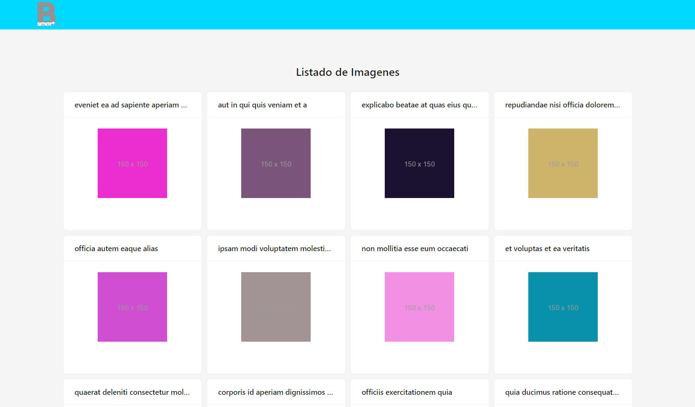
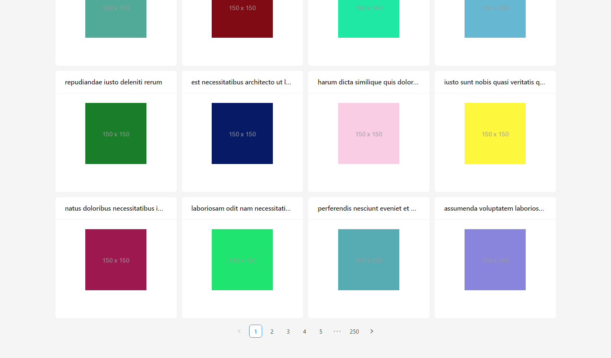
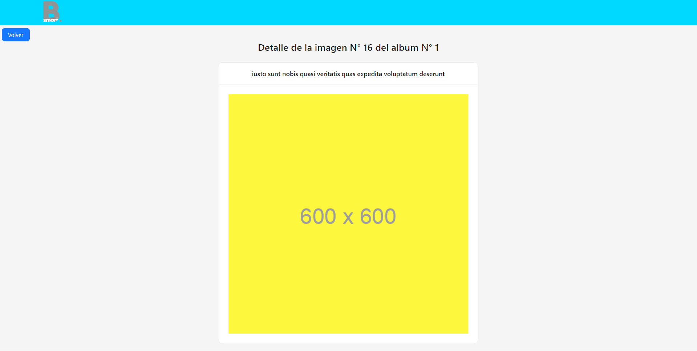

# DESAFÍO FRONTEND

## Tecnologías usadas

* VITE + REACT 

## Instrucciones de instalación y ejecución

Para ejecutar la aplicación en tu ordenador, necesitas tener instalado Node.js y NPM (o Yarn). Luego, sigue estos pasos:

* Clona el repositorio o descarga el código fuente.
* En la terminal, navega hasta el directorio raíz del proyecto.
* Ejecuta el comando npm install (o yarn install) para instalar las dependencias.

## Fotos

